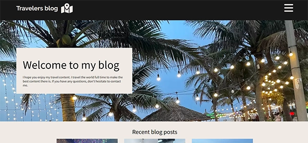

## Project Exam 1
# Travelers blog




  This was my exam project where we got to show everything we have learned this first year of Front-End Developer study. I chose to make a traveler's blog since it matches my lifestyle pretty good these days. 

## Description

On this assignment I chose to focus more on the code then the design. It was the exam and I really wanted to show that I can manage all the things we have learned this year. The design was universal accessibility, wich has been an important thing for me this year since they change the roles in Norway for it. We had to fetch the content for our website to be stored on a WordPress installation used as a Headless CMS. And make an easy to navigate, good looking website with HTML, CSS and JavaScript.  

Under is some of the requirements we had to meet

- Install WordPress on your web host and add the blogs on the admin panel.
- Install Hotjar on your website. 

## Built With

Tech stack for this project  

- [HTML5](https://dev.w3.org/html5/spec-LC/)
- [CSS](https://www.w3.org/Style/CSS/Overview.en.html)
- [JavaScript](https://developer.mozilla.org/en-US/docs/Web/JavaScript)
- [Wordpress](https://wordpress.com/)

## Getting Started

### Installing

To clone this repo you run the command that is listed under here. From there you can make your changes and deploy it as you like. I recommend Netlify + Github. This project is written 100% by me, and you can use it however you like.

1. Clone the repo:

```bash
git clone git@github.com:bettytro/SemesterProject.git
```


### Running

This project is fully built on front-end tools like HTML & CSS. There is no dependencies or setup to make it run optimally. You can run it in your normal browser. Just open index.html in your favorite browser, and you're all good.


## Contributing

If you want to contribute to this project, you can message me on any of my socials. You can find them on my [Github profile](https://github.com/bettytro). I will not observe this project that closely, but please make a pull request, and I will review it as soon as possible.

## Contact

If you want to get in touch, please send me a message on Facebook or Discord 

[My Facebook](https://www.facebook.com/elisabeth.trondsen.14/)

[My Discord](discordapp.com/users/yourID1009006668291518517)
 
## Level 1 Process

1.	Decide on the theme for the blog you’re going to make
2.	Create a prototype of the website
3.	Install WordPress on your web host and add the blogs on the admin panel. 
4.	Use the GitHub repo created by GitHub Classroom for your files and deploy to Netlify
5.	Build your website using HTML, CSS and JavaScript making a call to the WordPress REST API to fetch your data.
6.	Install Hotjar on your website.
7.	Ask users to test your website, and adjust based on their feedback and any insights from Hotjar.
8.	Write a report documenting your project (template provided in this repository).
9.	Submit your report as a PDF and a link to both your Netlify deployment and your GitHub repo.
 
## Level 2 Process (optional)

1.	You can try adding a sort, filter, or search to the blog posts page allowing users to find the blog post more easily that they’re looking for. 
2.	Post the data from the contact form to WordPress so you have the details saved.
3.	Allow users to submit comments on a blog post, and post this data to WordPress

